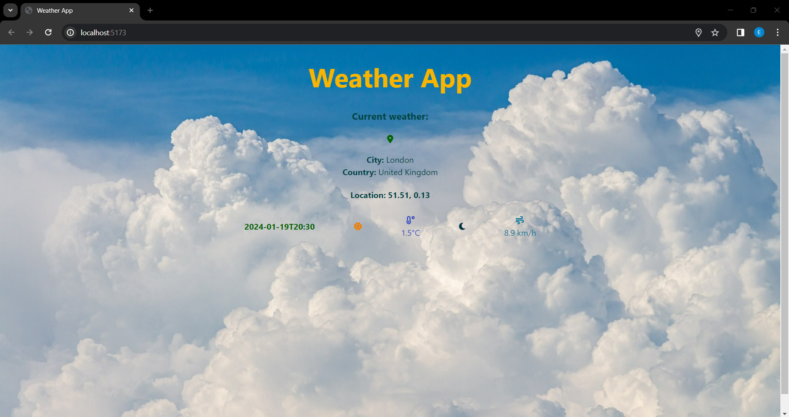

# React Weather App

Basic weather app created using the React framework for JavaScript and the Vite package. **Make sure to hover over the icons** when running the project to see the tooltips.

The APIs I used in this project are https://api.open-meteo.com/v1/forecast for the weather information and https://geocode.maps.co/ for the reverse geolocation information (turning coordinates for longitude and latitude to location name). It only has the single home page with weather info for a specific location (based on user location or the default is set to London, UK).

The `weather-app` directory contains the app that connects with the various APIs. You will need to *replace the API key value in the `.env` file* for the project in `weather-app` directory to work for you.

The `weather-app-simulation` directory contains the same weather app, but with simulated API calls to display data that you can edit and trial without any need for an API or API key.

## Weather App in action

Home:



Hover results:


## Getting started

You will need to have [Node.js](https://nodejs.org/en/download) and npm installed to run this project.

To start an empty project with Vite use the following command: `npm create vite@latest` and then follow the prompts to name and select starter project type etc.

Dependencies for this project:

```json
"@fortawesome/fontawesome-svg-core": "^6.5.1",
"@fortawesome/free-solid-svg-icons": "^6.5.1",
"@fortawesome/react-fontawesome": "^0.2.0",
"react": "^18.2.0",
"react-dom": "^18.2.0",
"react-geolocated": "^4.1.2",
"react-tooltip": "^5.25.2"
```

To install the dependencies use the command `npm i`. Or to install individual components use the command `npm i` followed by the package name e.g. `npm i react-tooltip` or `npm i @fortawesome/react-fontawesome` or combine them as follows `npm i react-tooltip @fortawesome/react-fontawesome`.

Once these dependencies are installed then the code can be run by navigating to the correct directory and using the command `npm run dev`.

**Note on API key:** Store your API keys in environment variables. This way, the keys are kept separate from your codebase. You can access these environment variables in your React code.

**To set up environment variables with Vite, you can follow these steps:**
1. Create an `.env` file in the root of your project.
2. Prefix your environment variables with `VITE_` in the `.env` file. For example, `VITE_API_KEY=yourapikey`.
3. Access your environment variables shown in the code below:
  
    ```jsx
    const apiKey = import.meta.env.VITE_API_KEY;
    ```

*Note:* Vite will load the `.env` file at the start of the application. Restart the server after making changes to the `.env` file

In your Vite configuration file (`vite.config.js`), you can use the `loadEnv` helper to load the specific `.env` file based on the mode. Like this:

    ```js
    import { defineConfig, loadEnv } from 'vite';
    
    export default defineConfig(({ command, mode }) => {
      // Load env file based on `mode` in the current working directory.
      // Set the third parameter to '' to load all env regardless of the `VITE_` prefix.
      const env = loadEnv(mode, process.cwd(), '');
      return {
        // Vite config
        define: {
          __API_ENV__: JSON.stringify(env.API_ENV),
        },
      };
    });
    ```

## Acknowledgements

The background image that I used in my design can be found [here](https://pixabay.com/photos/clouds-nature-sky-cumulus-weather-4215608/) and credit goes to the publisher.
